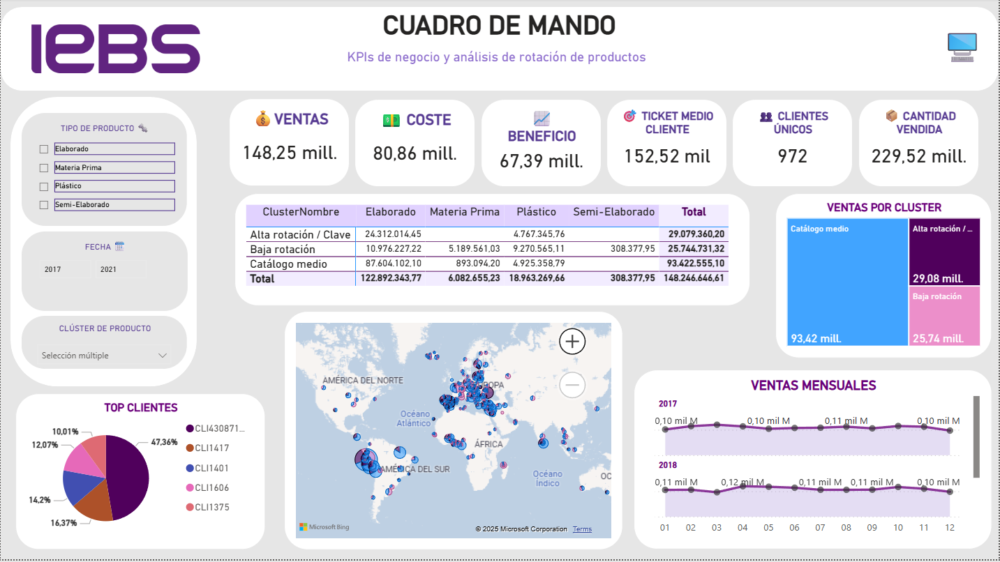

# 🧠 Análisis de rotación de productos y optimización de catálogo (TFM IEBS)

Este proyecto fue desarrollado como Trabajo Final del Máster en Business Intelligence y Análisis de Datos (IEBS Business School).

Se centra en una empresa industrial ficticia con el objetivo de analizar su catálogo de productos, detectar patrones de venta y facilitar decisiones estratégicas.

---

## 📌 Objetivos del proyecto

- Analizar la rotación de productos y su rentabilidad
- Optimizar el catálogo para reducir stock no rentable
- Implementar segmentación automática con IA (clustering)
- Visualizar los datos en un dashboard dinámico en Power BI

---

## 🛠 Tecnologías y herramientas

- **Power BI**: modelo de datos, DAX, visualizaciones, segmentadores
- **SQL Server**: conexión directa a base de datos .bak (ERP Navision)
- **Python**: clustering K-means (scikit-learn), análisis exploratorio
- **Power Query**: limpieza previa de datos

---

## 🧱 Componentes del repositorio

- `dashboard.pbix`: archivo del cuadro de mando en Power BI
- `TFM_Sandra_Conca.pdf`: documento completo del trabajo
- `Kmeans.ipynb`: notebook Python para segmentación de productos

---

## 📊 Capturas del dashboard_

---

## 📥 Acceso al proyecto

📄 [Ver memoria del proyecto (PDF)](./TFM_Sandra_Conca.pdf)  
📊 [Descargar archivo Power BI (Google Drive)](https://drive.google.com/file/d/1kHD48z7H1_3-GlRC8iivcL4pzRELgOGv/view?usp=sharing)
🐍 [Algoritmo KMeans en Python](./KMeans.ipynb)

---

## 👩‍💻 Autora

Sandra Conca Gómez  
📧 sandraconcagomez@gmail.com  
🔗 [LinkedIn](https://www.linkedin.com/in/sandraconcagomez/)